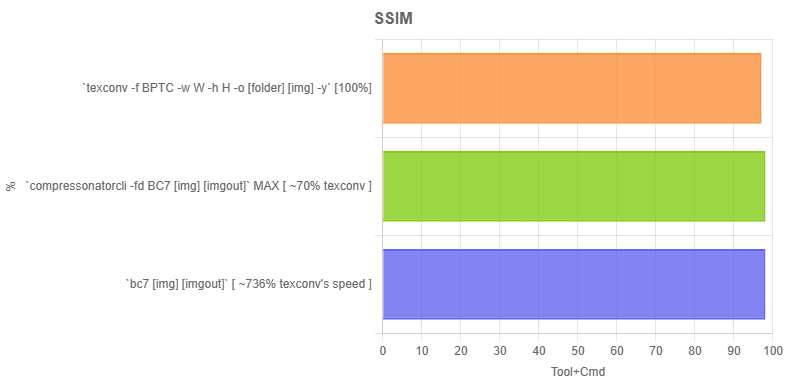

## BC7 Encoder

This version actually knows what it's doing and optimizes for any real world texture with minimal compilation setup. It is completely beginner friendly and that's it.

Now for PSNR comparison...



Yep. Mine's virtually identical, and also (possibly) better quality than others, except it's multitudes faster because I just observed the exact speed of each of the encoders on the list and have done vastly big amounts of other plentiful optimizations, including but not limited to mode stealing (which does ).

---

*So here's my story:*

So, Funkin' View needed another compressed texture format that's NATIVE to PC, and I naturally went to choose BC7 because all of the other pc-native texture compression algorithms just compress color or do basic block math.

However, in doing this, I encountered a few issues trying to find the most efficient bc7 encoder that's inside a command line tool and that you don't have to compile at all and use:

1. DirectXTex (made by Microsoft of all people)

...has a basic bc7/bptc encoder that apparently uses an academic variant of compressing bc7, which has been baked into other texture formats, even USING the GPU, but doesn't mean I'll be relying on texconv for real-time bc7 compression either.

It utilizes no optimizations, if at all, because of the fact it's even stuck being an academic version made by a giant corp.

It's also a waste of the GPU's resource, but I was thinking for bit "why not just try to compile it and fix the issue?"

...Exactly.

2. Richgell's BC7E/F_RDO

You've never heard of this person, because he's had this strange but super-niche hobby of a specific texture compression known as bc7, where he tries to experiment with optimizing it, such as RDO for example (**Rate Distortion Optimization**), and even programming the whole ass encoder in ispc, which added a few MORE layers of compelxity.

Fuck it, the ISPC version of bc7 compression was discontinued and so you , and intel themselves have ceased all future updates of it.

When going to basis universal (which I actually found about very early on in my bc7 compression rabbithole), I saw it as a bulky ass compressed texture transcoder, which does not fit my purpose at all.

*This tool's based on their ispc code though!*

It does have bc7f in it, whichh... Eh, not really gonna bother.

bc7f/rdo (as far as I know) is to build yourself whilst it's average efficiency proper bc7 compression code, just with ISPC instead to apparently "speed" up the process.

3. AMD's compressinator

The fact BC7 encoding performs this bad on a specific tool like is insane. Compressinator is very bulky, meaning it's not easily just a lightweight cross-platform drop in feature, and even that's stuck as an ACADEMIC version (literally), just like texconv.

It does have GPU options, but I'm also not willing to handle all gpu options, as they're technically useless to me anyway.

Fuck it, i'll even go as far as saying it's built for NVIDIA.

You can like compressinator all you want, but I still think it has some bulk speed. I initially struggled to be nice here, because I tried the tool myself specifically with png to BC7.

4. My tool

After 3/4 of the journey though, I had the idea of getting AI to convert the richgell bc7enc's ispc file into actual c++ code that I can just work with, at all times.

I had tried getting the AI to write me a simd-to-width, which in fact didn't work at all, and just broke the AVX2 path with fine details of a specific type of block turning into a blocky mess, so I just removed that.

Second thing I tried testing was just having AI revamp my code to use SSE2 and then doing workstealing, only to get a glitchy looking texture that's consistent green-blue mess with way more alpha and random colors as THE 4x4 block.

Last thing I tried was just getting Qwen to suggest me some other optimizations, and I'll have to highlight the BEST of the ones I tried.

Basically:

1. I just reduced the max partitions for mode 2 from 64 to 8, which was already pretty impactful even doing 16, and then...

2. I just did a bit more small optimizations since I most often test spritesheets of a big ass size.

And for the last optimization I did, was just rewriting the `evaluate_solution` function to use integer LUT's, which let the compiler autovectorize the rest of that part, which is already impressive.


And for that, I've successfully crafted the most efficient multithreading bc7 encoder tool that's ready for you to just drop in your game and use in real time.

You can even load it in bulk safely as well, because you can essentially launch the same process over and over and it'd still work efficiently.

Also note there's no quality option because this is already at its max possible CPU efficiency whilst retaining visual fidelity.

*And no SIMD was even used in this (not even std::fma), as with what I said earlier. This library already compiles with autovectorization no matter what.*

I don't give a fuck if you credit me or not, because this tool would start showing up more often as it lives, due to having great potential of being both beginner-friendly and optimized for extreme speed.

And as a final conclusion...

**This is the only bc7 compression tool that's both ultra-optimized and as a command-line tool, baked into my passion project "Funkin' View".**

The end. Now, please try it out. Your mind will be BLOWN.

*Wait, I forgot something. Not only is it fast on its own, but thanks to recently implementing a concurrency technique known as "atomic work stealing" (kudos to qwen3.7-plus), encoding to bc7 can now be as fast as humanly possible on like L1 cache, which is ridiculous, so in theory, this is the fastest possible software bc7 compression tool indefinitely.*

## Benchmark (sorta)

The numbers speak for themselves:

```
F:\_\NewDownloads\official-bc7-encoder\v3>myprogram dad.png dad.dds
Loaded dad.png: 3950x1680 (4 ch)
Encoder path: Scalar
Encoded 414960 blocks in 127.9 ms (3245074 blocks/sec, 6 threads, Scalar)
Original: 26544000 bytes, BC7: 6639360 bytes (4.00:1, 25.0%)
Wrote dad.dds

F:\_\NewDownloads\official-bc7-encoder\v3>myprogram dad.png dad.dds
Loaded dad.png: 3950x1680 (4 ch)
Encoder path: Scalar
Encoded 414960 blocks in 133.3 ms (3113060 blocks/sec, 6 threads, Scalar)
Original: 26544000 bytes, BC7: 6639360 bytes (4.00:1, 25.0%)
Wrote dad.dds

F:\_\NewDownloads\official-bc7-encoder\v3>myprogram dad.png dad.dds
Loaded dad.png: 3950x1680 (4 ch)
Encoder path: Scalar
Encoded 414960 blocks in 121.0 ms (3430068 blocks/sec, 6 threads, Scalar)
Original: 26544000 bytes, BC7: 6639360 bytes (4.00:1, 25.0%)
Wrote dad.dds

F:\_\NewDownloads\official-bc7-encoder\v3>myprogram dad.png dad.dds
Loaded dad.png: 3950x1680 (4 ch)
Encoder path: Scalar
Encoded 414960 blocks in 131.1 ms (3166116 blocks/sec, 6 threads, Scalar)
Original: 26544000 bytes, BC7: 6639360 bytes (4.00:1, 25.0%)
Wrote dad.dds
```

Compared to texconv, if the same size, would be SO much slower, like I'm talking a rough ~7.9x slowdown on the exact spritesheet and its size, just to get as good of an output quality as with this tool.

and compared to amd's compressonator, which in fact is even worse than texconv, and I'm also forced to multiple by 4 texture if I try to do GPU mode, but I'll say it's like around 18-20 times due to how slow it compresses even a texture that's only ~500x500, which in fact I have known the default is basically max quality.

*I even had to time it myself with stopwatch on windows' Clock app due to the fact there's no said precise time being printed in the end.*

It also doesn't matter if it's power of two, because this is entirely CPU-based and multithreaded.

## Comparison time! (finally)

(views from [tacentview](https://github.com/bluescan/tacentview))


BC7 output with bc7-encoder


PNG reference

**Now, for a highlight, here:**

